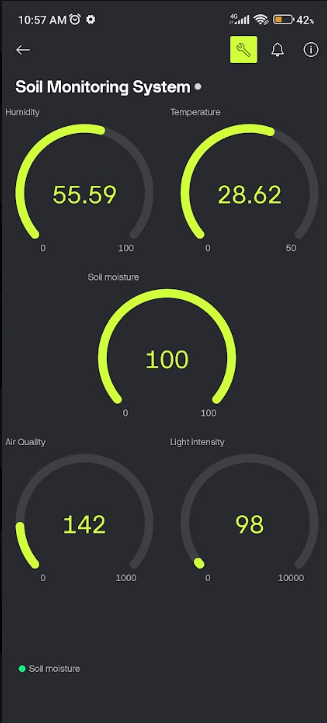

# IoT-Based Soil Monitoring System


## 1. Description
This project is an IoT-based soil monitoring architecture built on an ESP32 microcontroller. It continuously tracks critical environmental and soil metrics, sampling data every 10 seconds. The system pushes real-time telemetry to a remote Blynk IoT dashboard, displays live readings locally on an OLED screen, and integrates with a Machine Learning API to predict the overall health state of the soil (Healthy, Moderate, or Critical). An automated buzzer acts as a fail-safe alert when readings cross into critical thresholds.

**Key Features:**
*   **Multi-Sensor Tracking:** Monitors Temperature, Humidity, Soil Moisture, Light Intensity, and Air Quality (Gas).
*   **Real-Time Remote Dashboard:** Fully integrated with the Blynk mobile app for remote monitoring.
*   **Machine Learning Integration:** Sends HTTP POST requests to a Flask/Python server to classify the current environmental state.
*   **Local Feedback:** Live updates on an SSD1306 OLED display and audible alerts via a buzzer for critical states.

## 2. Visuals & Demo

**Blynk IoT Mobile Dashboard**  
The remote dashboard provides live gauges for all connected sensors.  


**Repository Overview**  

*(Note: Replace `application.png` in the repository with your actual project photo if desired).*

## 3. Hardware Architecture & Wiring

**Core Components:**
*   **Microcontroller:** ESP32
*   **Temperature & Humidity:** Adafruit SHT4x (I2C)
*   **Light Sensor:** Adafruit VCNL4040 (I2C)
*   **Display:** 128x64 SSD1306 OLED (I2C)
*   **Analog Sensors:** Soil Moisture Sensor, Gas/Air Quality Sensor
*   **Alert:** Active Buzzer

**Pin Configuration:**
*   **Soil Moisture Sensor:** Pin `34`
*   **Gas Sensor:** Pin `35`
*   **Buzzer:** Pin `25`
*   **I2C Devices (OLED, SHT4x, VCNL4040):** Standard ESP32 I2C Pins (SDA: `21`, SCL: `22`)

## 4. Prerequisites & Installation

### Software Requirements
*   [Arduino IDE](https://www.arduino.cc/en/software)
*   ESP32 Board Package installed in Arduino IDE

### Required Libraries
Install the following via the Arduino Library Manager:
*   `Blynk`
*   `Adafruit SHT4x Library`
*   `Adafruit VCNL4040`
*   `Adafruit GFX Library`
*   `Adafruit SSD1306`

### Setup Instructions
1.  **Clone the Repository:**
    ```bash
    git clone [https://github.com/Piyush-Sambyall/Soil_Monitoring_System.git](https://github.com/Piyush-Sambyall/Soil_Monitoring_System.git)
    ```
2.  **Configure Network & IoT Settings:**
    Open the `.ino` sketch and update the following credentials:
    ```cpp
    // WiFi Credentials
    char ssid[] = "YOUR_WIFI_SSID";
    char pass[] = "YOUR_WIFI_PASSWORD";

    // Blynk Credentials
    #define BLYNK_TEMPLATE_ID "TMPL30WmZXpP8"
    #define BLYNK_TEMPLATE_NAME "Soil Monitoring System"
    #define BLYNK_AUTH_TOKEN "YOUR_AUTH_TOKEN"
    ```
3.  **Configure the ML Server Endpoint:**
    Update the `serverName` variable with the IP address of your machine learning prediction server:
    ```cpp
    String serverName = "http://YOUR_SERVER_IP:5000/predict";
    ```
4.  **Flash the Code:** Connect your ESP32 and upload the sketch.

## 5. Usage & Data Flow

Once powered on, the ESP32 will connect to WiFi and the Blynk cloud. 

**Blynk Virtual Pin Mapping:**
*   `V0`: Soil Moisture (%)
*   `V1`: Temperature (°C)
*   `V2`: Humidity (%)
*   `V3`: Light Intensity (Lux)
*   `V4`: Air Quality / Gas (Raw Analog)
*   `V5`: ML Prediction State (String)

**Machine Learning Pipeline:**
Every 5 seconds, the ESP32 formats the sensor data into a JSON payload and sends an HTTP POST request to the ML server. The server responds with a classification (`Healthy`, `Moderate`, or `Critical`). If the response is `Critical`, the ESP32 triggers the local buzzer for 5 seconds to alert nearby personnel.

## 6. Author
**Piyush Sambyal**
